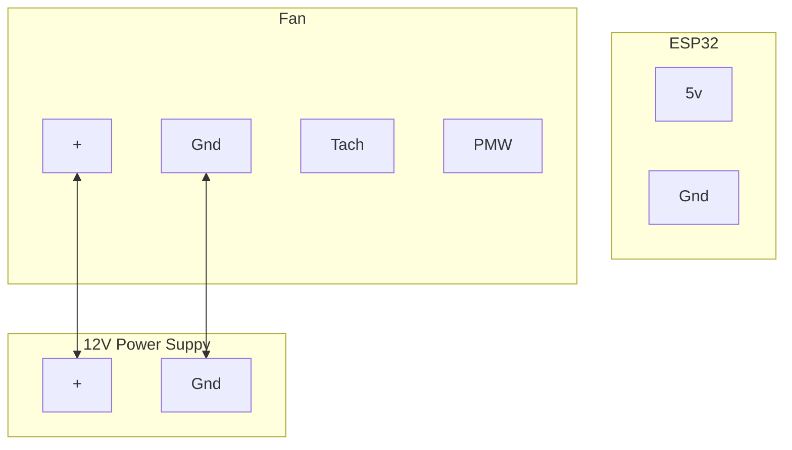

# Wiring Diagram
Testing github rendinger....

```mermaid
flowchart TD
    subgraph ESP32
        esp_55[5v]
        esp_gnd[Gnd]

    end

    subgraph 12V Power Suppy
        12v+[+]
        12v-[Gnd]
    end

    subgraph Fan
        fan+[+]
        fan-[Gnd]
        fanTach[Tach]
        fanPmw[PMW]
    end

    fan+ <--> 12v+
    fan- <--> 12v-


```