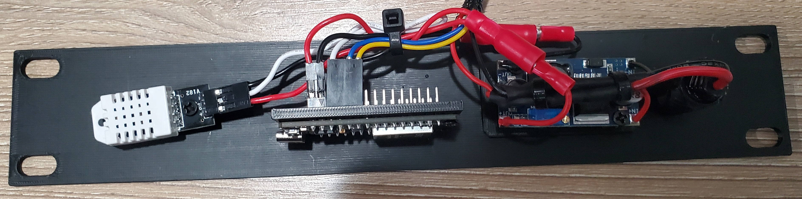
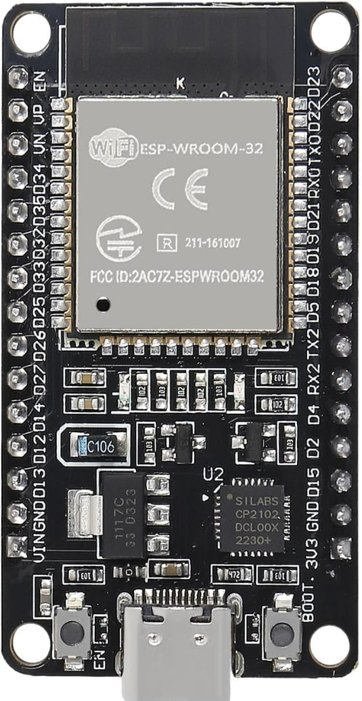
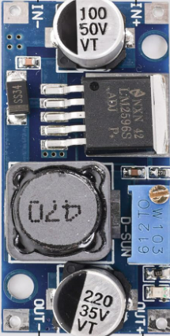
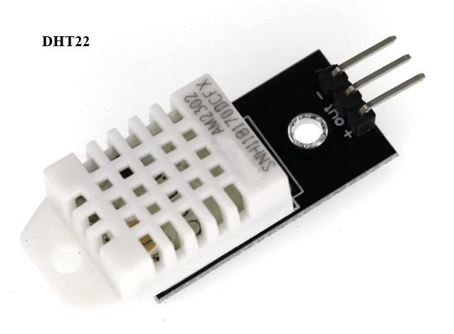
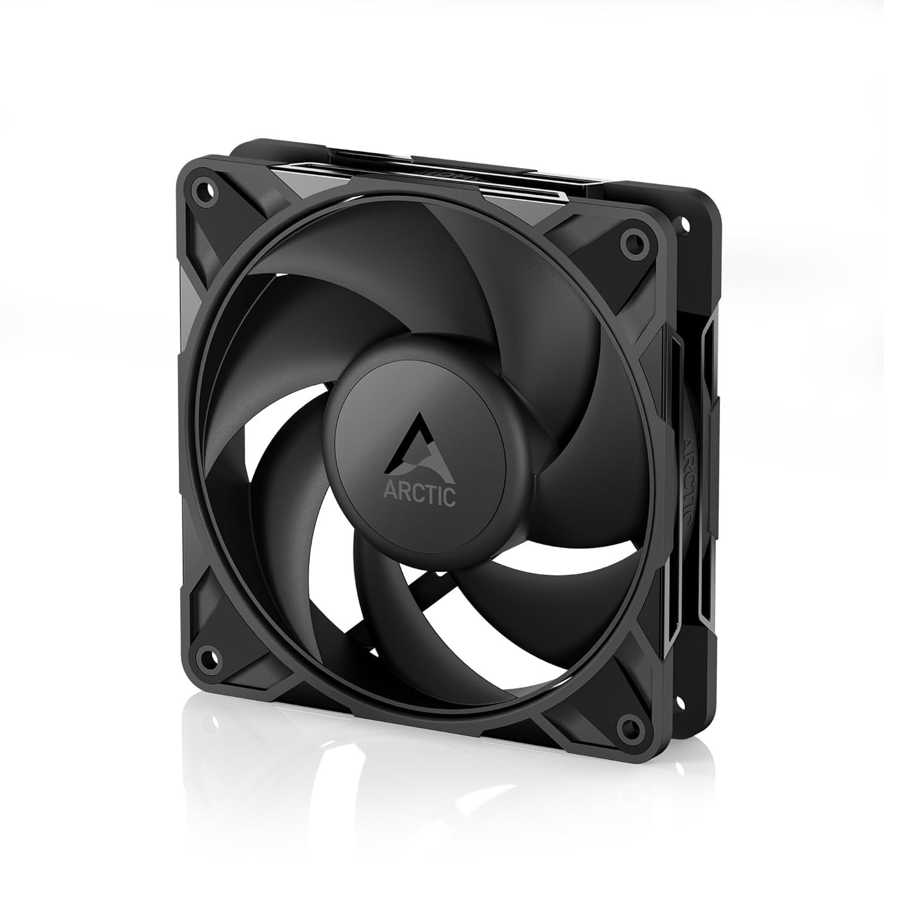
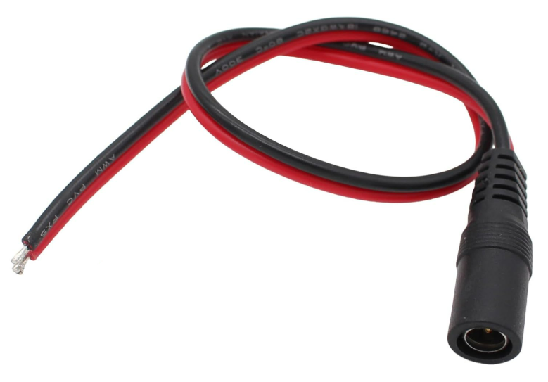
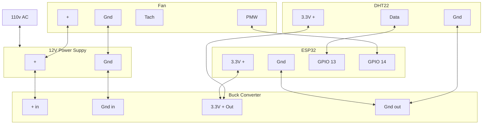
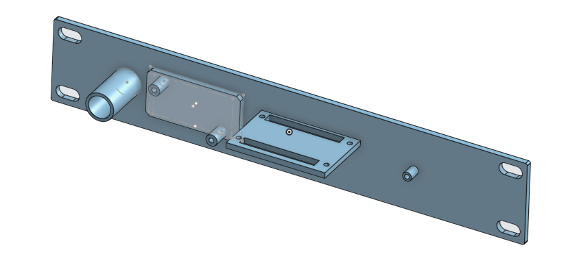

# Lab Rax Cooling Fan Controller
As Homelab Upgrade 2026 progress, I've gotten to a point
where I want to install a fan in my Lab Rax mini rack.

This turned out to be a bigger adventure than I expected
and throughout the process I collected a bunch of information 
that I will never remember, so I've captured my notes.

While I'm focused on my Lab Rax build this setup should
work in any number of situations

## Components

<table>
  <thead>
    <th>Component</th>
    <th>Source</th>
    <th>Thumbnail</th>
  </thead>
  <tbody>
    <tr>
      <td>ESP32</td>
      <td>
        <a href="https://www.amazon.com/dp/B0CR5Y2JVD?th=1">Amazon</a>
      </td>
      <td>
        
      </td>
    </tr>
    <tr>
      <td>12v Buck Converter</td>
      <td>
        <a href="https://www.amazon.com/dp/B0DBVYP91F?ref=ppx_yo2ov_dt_b_fed_asin_title&th=1">Amazon</a>
      </td>
      <td>
        
      </td>
    </tr>
    <tr>
      <td>DHT22</td>
      <td>
        <a href="https://www.amazon.com/dp/B0FK5K45KF">Amazon</a>
      </td>
      <td>
        
      </td>
    </tr>
    <tr>
      <td>120mm Fan</td>
      <td>
        <a href="https://www.amazon.com/dp/B0DJDC74BP">Amazon</a>
      </td>
      <td>
        
      </td>
    </tr>
    <tr>
      <td>12v Barrel Connector</td>
      <td>
        <a href="https://www.amazon.com/dp/B0D8BDX6Q5?th=1">Amazon</a>
      </td>
      <td>
        
      </td>
    </tr>
  </tbody>
</table>

## Power Budget
Assuming an 85% buck efficiency

| Component | Voltage | Current (Max) | 12V Input Current (Max) |
| --------- | ------- | ----------    | ----------------------- |
| ESP32     | 3.3V    | 0.50 A        | 0.16 A                  |
| Fan       | 12V     | 0.33 A        | 0.33 A                  |
| DHT22     | 3.3 V   | 0.0025 A      | 0.0007 A                |
|           |         |               |                         |
| **Total** |         |               | **0.49 A**              |

## Wiring
### Diagram

## 3D Printed Custom Mount

[STL File](./Fan%20Controller%20-%20Mini%20Rack%20Mount.stl)

[Step File](./Fan%20Controller%20-%20Mini%20Rack%20Mount.step)

[onshape](https://cad.onshape.com/documents/b9def82ccf3bdff9cf5f2438/w/35c5b6c4bbd6ace056f11a3f/e/4fe5b528b247836f305f482f?renderMode=0&uiState=69868e02ddd392090bf928a6)

## Code
See [RackFanWithTempSensorv1.ino](./RackFanWithTempSensorv1.ino)

## ESP32 Pinout

## References
Here are a few references I leveraged along the way.
* https://esp32io.com/tutorials/esp32-dht22
* https://randomnerdtutorials.com/esp32-dht11-dht22-temperature-humidity-sensor-arduino-ide/
* https://dronebotworkshop.com/esp32-pwm-fan/

## Notes & Observations

Avoid `GPIO12`- This is tied in with the flashing process. Everything will work fine
through the flashing process and you won't suspect a thing until you physically power
cycle the device. At that point it just gets into a reboot loop. I ran into this 
when it was attached to fan PWM. Unclear if similar problems on other functionality.

Tachometer was not reliable. It would only properly record when fan duty was at 100%.
This was fine as I don't actually need to monitor RPMs and I only discovered this
while playing around
