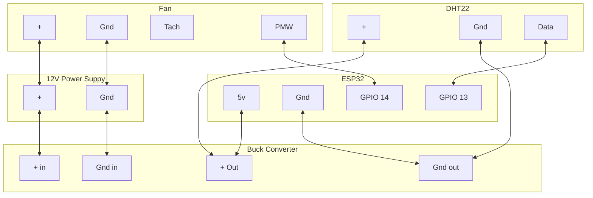

# Wiring Diagram
Physical Wiring Connections are as follows:

```mermaid
flowchart TD
    subgraph ESP32
        esp_55[5v]
        esp_gnd[Gnd]
        esp13[GPIO 13]
        esp14[GPIO 14]
    end

    subgraph 12V Power Suppy
        12v+[+]
        12v-[Gnd]
    end

    subgraph DHT22
        dht+[+]
        dht-[Gnd]
        dhtData[Data]
    end

    subgraph buck[Buck Converter]
        buckIn+[+ in]
        buckIn-[Gnd in]
        buckOut+[+ Out]
        buckOut-[Gnd out]
    end

    subgraph Fan
        fan+[+]
        fan-[Gnd]
        fanTach[Tach]
        fanPmw[PMW]
    end

    dhtData <--> esp13

    fanPmw <--> esp14

    12v+ <--> buckIn+
    12v- <--> buckIn-

    fan+ <--> 12v+
    fan- <--> 12v-

    dht+ <--> buckOut+
    dht- <--> buckOut-
    

    esp_55 <--> buckOut+
    esp_gnd <--> buckOut-

```