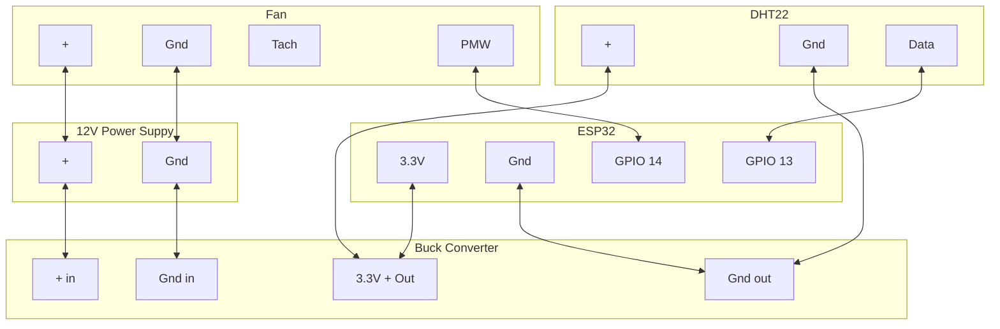

# Lab Rax Cooling Fan Controller
As Homelab Upgrade 2026 progress, I've gotten to a point
where I want to install a fan in my Lab Rax mini rack.

This turned out to be a bigger adventure than I expected
and throughout the process I collected a bunch of information 
that I will never remember, so I've captured my notes.

While I'm focused on my Lab Rax build this setup should
work in any number of situations

## Components
* ESP 32
* 12v Buck Converter
* DHT22
* 120mm Fan

## Power Budget
Assuming an 85% buck efficiency

| Component | Voltage | Current (Max) | 12V Input Current (Max) |
| --------- | ------- | ----------    | ----------------------- |
| ESP23     | 3.3V    | 0.50 A        | 0.16 A                  |
| Fan       | 12V     | 0.33 A        | 0.33 A                  |
| DHT22     | 3.3 V   | 0.0025 A      | 0.0007 A                |
|           |         |               |                         |
| **Total** |         |               | **0.49 A**              |

## Wiring
### Diagram

## Printed Case

## Code
TK

## Notes & Observations
